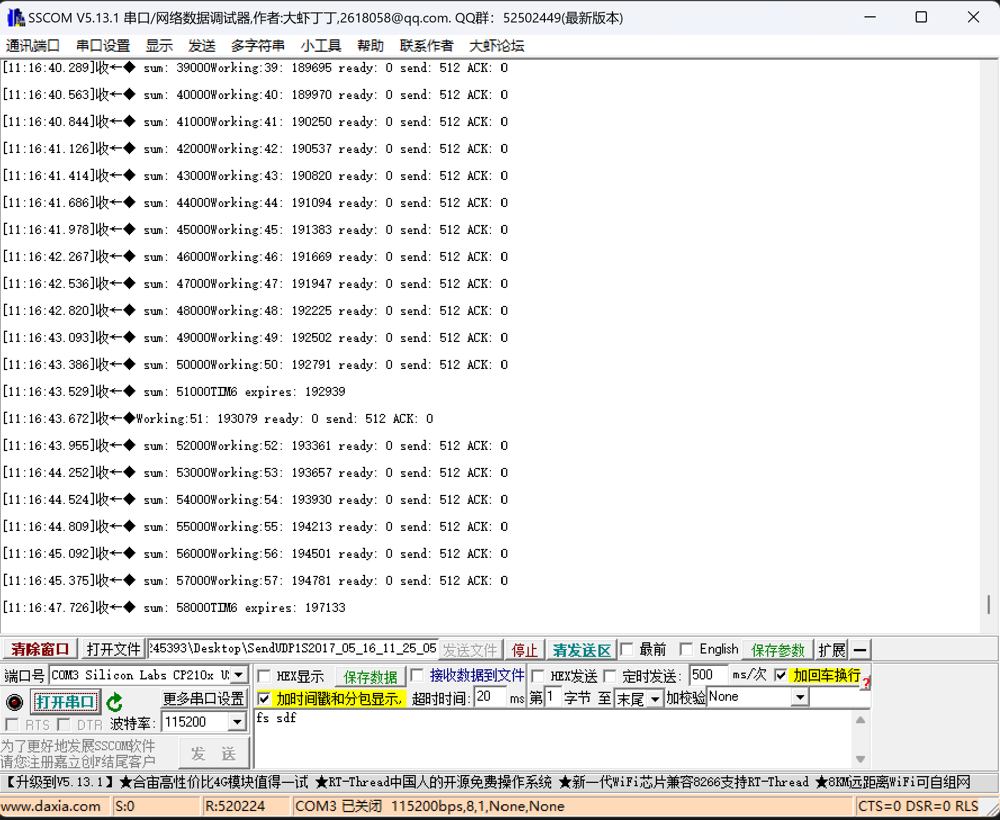
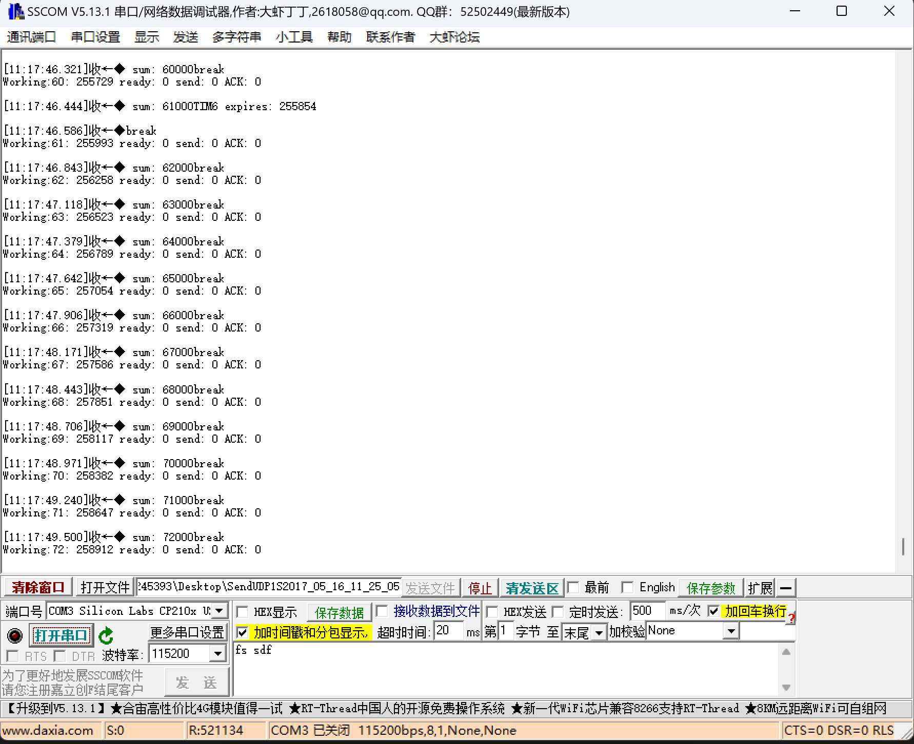

# 微处理器与系统实验报告三-发送方

## 小组成员
- 2021213243 张若琛
- 2021213250 周涵扬

## 代码地址：https://github.com/mkmk3333/test1 test3Send分支

## 1. 实验的具体设计和实现方式
- 示意图：
  

- 具体设计：
  - 连接方式：
    - 发送方GPIOC连接接收方GPIOC
    - 发送方GPIOF连接发送方SW
    - 接收方GPIOF连接接收方SW
  - 引脚使用情况（发送方接收方相同）：
    - GPIOC：
      - PC0~PC7：数据传输引脚，位宽8bit
      - PC8：Ready信号引脚，查询传送方式下读取接收方发送的Ready信号
      - PC9：Send信号引脚，查询传送方式下向接收方发送Send信号
      - PC10：Ack信号引脚，查询传送方式与中断传输方式下读取接收方发送的Ack信号
      - PC11：中断信号引脚，中断传送方式下向接收方发送中断信号
    - GPIOF：
      - PF0：连接至sw0，控制串口是否输出
      - PF1：连接至sw1，控制数据以查询传送方式发送，打开开始发送数据，关闭停止发送
      - PF2：连接至sw2，控制数据以中断传送方式发送，打开开始发送数据，关闭停止发送
- 实现方式：
  - 查询传送方式：
    - 流程：
      1. 发送方读取接收方Ready信号，若为1则进入发送流程
      2. 发送方修改数据传输引脚电平，传输数据
      3. 发送方向接收方发送Send信号
      4. 接收方收到Send信号后将Ready置0
      5. 接收方读取数据传输引脚电平，获得数据
      6. 接收方向发送方发送Ack信号
      7. 发送方收到Ack信号后将Send信号置0，准备下一次传输
      8. 接收方将Ack信号置0，将Ready信号置1，准备下一次传输
    - 信号含义：
      - Ready：接收方是否可以接收数据
      - Send：发送方是否完成数据发送
      - Ack：接收方是否完成数据接收
    - 发送数据设置：
      - 每一次发送过程发送一个8位二进制数，一次发送8bit
      - 循环发送0~255共256个数，一次循环总计发送256Byte
      - 每完成1000次循环，总计发送256000Byte后向输出方与发送方串口发送一次调试信息
        - 调试信息：总计发送循环数、主循环工作次数、程序启动时长、Ready信号值、Send信号值、Ack信号值
  - 中断传送方式：
    - 流程：
      1. 发送方修改数据发送引脚电平，发送数据
      2. 发送方修改中断信号引脚电平，触发接收方中断，准备下一次传输
      3. 接收方产生外部中断，进入中断服务流程
      4. 接收方调用中断回调函数，读取数据传输引脚电平，接收数据，准备下一次传输
    - 信号含义：
      - 中断信号：发送方是否为完成数据发送
    - 中断：
      - EXTI15_10_IRQn：外部中断，由引脚10~15触发
    - 发送数据设置：
      - 每一次发送过程发送一个8位二进制数，一次发送8bit
      - 循环发送0~255共256个数，一次循环总计发送256Byte
      - 每完成1000次循环，总计发送256000Byte后向输出方与发送方串口发送一次调试信息
        - 调试信息：总计发送循环数、主循环工作次数、程序启动时长、Ready信号值、Send信号值、Ack信号值
  - 运行流程：
    1. 打开两实验箱电源
    2. 打开两实验箱sw0，输出串口信息
    3. 打开发送方sw1，开始以查询传输方式传输数据
    4. 关闭sw1后打开sw2，开始以中断传输方式传输数据（sw1与sw2不可同时打开）
    5. 关闭sw2后可观察串口输出信息
  
## 2. 源代码及详细注释：
- 发送方
- GPIO初始化及中断初始化：
``` c
static void MX_GPIO_Init(void)
{
  GPIO_InitTypeDef GPIO_Initure;

  /* GPIO Ports Clock Enable */
  __HAL_RCC_GPIOH_CLK_ENABLE();
  __HAL_RCC_GPIOA_CLK_ENABLE();
  __HAL_RCC_GPIOF_CLK_ENABLE();
  __HAL_RCC_GPIOC_CLK_ENABLE(); //使能各个GPIO端口


  /*Configure GPIO pins : PC0 PC1 */
  GPIO_Initure.Pin = GPIO_PIN_8; /* 初始化Ready信号引脚 */
  GPIO_Initure.Mode = GPIO_MODE_INPUT; // 输入模式
  GPIO_Initure.Pull = GPIO_NOPULL;
  HAL_GPIO_Init(GPIOC, &GPIO_Initure);

  GPIO_Initure.Pin = GPIO_PIN_9; /* 初始化Send信号引脚 */
  GPIO_Initure.Mode = GPIO_MODE_OUTPUT_PP; // 输出模式
  GPIO_Initure.Pull = GPIO_NOPULL;
  HAL_GPIO_Init(GPIOC, &GPIO_Initure);

  GPIO_Initure.Pin = GPIO_PIN_10; /* 初始化Ack信号引脚 */
  GPIO_Initure.Mode = GPIO_MODE_INPUT; // 输入模式
  GPIO_Initure.Pull = GPIO_NOPULL;
  HAL_GPIO_Init(GPIOC, &GPIO_Initure);

  GPIO_Initure.Pin = GPIO_PIN_11; /* 初始化中断信号引脚 */
  GPIO_Initure.Mode = GPIO_MODE_OUTPUT_PP; // 输出模式
  GPIO_Initure.Pull = GPIO_NOPULL;
  HAL_GPIO_Init(GPIOC, &GPIO_Initure);

  GPIO_Initure.Pin = GPIO_PIN_0 | GPIO_PIN_1 | GPIO_PIN_2 | GPIO_PIN_3 | GPIO_PIN_4 | GPIO_PIN_5 | GPIO_PIN_6 | GPIO_PIN_7; /* 初始化数据传输引脚 */
  GPIO_Initure.Mode = GPIO_MODE_OUTPUT_PP; // 输出模式
  GPIO_Initure.Pull = GPIO_NOPULL;
  HAL_GPIO_Init(GPIOC, &GPIO_Initure);

  GPIO_Initure.Pin = GPIO_PIN_1 | GPIO_PIN_2; /* 初始化sw1,sw2引脚 */
  GPIO_Initure.Mode = GPIO_MODE_INPUT; // 输入模式
  GPIO_Initure.Pull = GPIO_NOPULL;
  HAL_GPIO_Init(GPIOF, &GPIO_Initure);

  GPIO_Initure.Pin = GPIO_PIN_0; /* 初始化sw0引脚 */
  GPIO_Initure.Mode = GPIO_MODE_INPUT; // 输入模式
  GPIO_Initure.Pull = GPIO_NOPULL;
  HAL_GPIO_Init(GPIOF, &GPIO_Initure);
}
```

- 查询传送方式：
``` c
if (HAL_GPIO_ReadPin(GPIOC, GPIO_PIN_8) == GPIO_PIN_SET) // 如果Ready信号为1
{
  if (HAL_GPIO_ReadPin(GPIOF,GPIO_PIN_1)==GPIO_PIN_SET) // 如果sw1打开，开始以查询传送方式传输数据
  {
    GPIOC->BSRR = (data & 0x00ff) | ( (~data & 0x00ff)<<16 ); // 修改数据传输引脚电平，发送数据
    data=(data+1)%256; // 增加数据值，循环发送
    if(data==255){ // 如果完成一次循环
      sum+=1; // 循环数加一
    }
    HAL_GPIO_WritePin(GPIOC, GPIO_PIN_9, GPIO_PIN_SET); // 向接收方发送Send信号
  }
  if(HAL_GPIO_ReadPin(GPIOC,GPIO_PIN_8)==GPIO_PIN_RESET) // 如还未收到Ack信号
  while(1){ // 进入死循环等待
    if (HAL_GPIO_ReadPin(GPIOC, GPIO_PIN_8)==GPIO_PIN_SET || HAL_GPIO_ReadPin(GPIOF,GPIO_PIN_1)==GPIO_PIN_RESET) // 收到接收方发送的Ack信号或结束数据传输
    {
      HAL_GPIO_WritePin(GPIOC, GPIO_PIN_9, GPIO_PIN_RESET); // 将Send信号置0
      break; // 退出等待
    }
  }  
}
```

- 中断传送方式：
``` c
if(HAL_GPIO_ReadPin(GPIOF,GPIO_PIN_2)==GPIO_PIN_SET) // 如果sw2打开，则以中断传输方式传输数据
{
  GPIOC->BSRR = (data & 0x00ff) | ( (~data & 0x00ff)<<16 ); // 修改数据传输引脚电平，发送数据
  data=(data+1)%256; // 增加数据值，循环发送
  if(data==255){ // 如果完成一次循环
    sum+=1; // 循环数加一
  }
  HAL_GPIO_WritePin(GPIOC,GPIO_PIN_11,GPIO_PIN_SET); // 发送中断信号
  HAL_GPIO_WritePin(GPIOC,GPIO_PIN_11,GPIO_PIN_RESET); // 将中断信号置0
}
```

- 结束数据发送： 
``` c
if(HAL_GPIO_ReadPin(GPIOF,GPIO_PIN_1)==GPIO_PIN_RESET && HAL_GPIO_ReadPin(GPIOF,GPIO_PIN_2)==GPIO_PIN_RESET){ // sw1或sw2关闭
  sum=0; // 清空总循环数
  data=0; // 清空发送的数据
}
```

## 3. 运行结果描述与展示
- 运行结果：
  - 查询传送方式：
      
  - 中断传送方式：
      
  - 运行完整流程已在验收时展示过，此处略去

## 4. 传输速度及改进
- 由实验结果可得：
  - 查询传送方式：
    - 每传输256*1000Byte约需280ms左右，速率合0.9MB/s左右
  - 中断传送方式
    - 每传输256*1000Byte约需265ms左右，速率合0.95MB/s左右
- 改进：
  - HAL库的引脚置位复位函数为了可读性增加了大量冗余，代码运行效率较直接操作IDR、ODR寄存器慢的多，直接对IDR、ODR寄存器进行操作可进一步提升速率
  - 若使用汇编语言进行操作可在对寄存器操作的基础上进一步提升速度
  - 开启O3优化可进一步提升速度，但会增加编译时间
  - 配置GPIO端口时将速度设为更高级别，如GPIO_SPEED_FREQ_MEDIUM与GPIO_SPEED_FREQ_HIGH 
