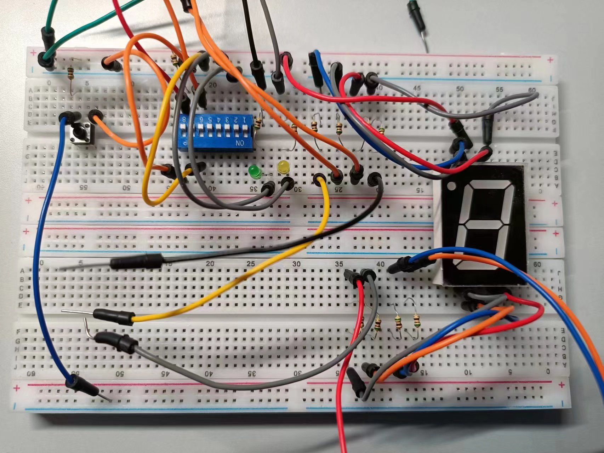

# 微处理器与系统实验报告二

## 代码地址：https://github.com/mkmk3333/test1 test2分支

## 1. 实验具体设计与实现方式

- 示意图（复现）：

  

- 具体设计：
  - 器件：
    - LED：
      - 绿色LED：对应PF0引脚，由开关sw1控制，sw1打开时灯亮，关闭时灯灭
      - 黄色LED：对应PF1引脚，由开关sw2控制，sw2打开时每500ms反转一次状态，即1000ms完成亮暗一个周期
      - 红色LED（图上未展示）：对应PF3引脚，触发中断EXTI9_5_IRQn时闪烁5次，每周期200ms
    - 8位拨码开关
      - 第8位：对应PC0引脚，作为开关sw1控制其余器件
      - 第6位：对应PC1引脚，作为开关sw2控制其余器件
      - 其余位：未使用
    - 按钮：
      - 按钮1：对应PC8引脚，作为按钮key1控制其余器件，按下时触发中断EXTI9_5_IRQn
      - 按钮2（图上未展示）：对应PC11引脚，作为按钮key2控制其余器件，按下时触发中断EXTI15_10_IRQn
    - 八段共阴极数码管：
      - abcdefg七段：对应PF8~PF14引脚，作显示数字用
      - h段（小数点）：未使用
  - 功能：
    - 打开开关sw1：绿色LED灯亮
    - 关闭开关sw1：绿色LED灯灭
    - 打开开关sw2：黄色LED开始闪烁
    - 关闭开关sw2：黄色LED停止闪烁
    - 按下按钮key1：红色LED开始闪烁，闪烁5次后自动停止
    - 按下按钮key2：数码管显示数字加一，在0~9间循环
- 实现方式：
  - 电路连接：
    - 电路连接方式如图所示，两根绿色导线分别连接至GND与+5V引脚作电源与地线，图上其余未连接引脚连接至排线上的相应引脚
  - 逻辑实现：
    - 开关相关逻辑通过在主循环中使用进行判断来执行相关语句
    - 按钮相关逻辑通过触发中断，在中断回调函数中改变相应变量值，在主循环中根据变量值执行对应语句

## 2. 源代码及详细注释

- GPIO与中断初始化：
``` c
/* main.c */
static void MX_GPIO_Init(void)
{
   GPIO_InitTypeDef GPIO_Initure;

  /* GPIO Ports Clock Enable */
  __HAL_RCC_GPIOH_CLK_ENABLE();
  __HAL_RCC_GPIOA_CLK_ENABLE();
  __HAL_RCC_GPIOF_CLK_ENABLE(); 
  __HAL_RCC_GPIOC_CLK_ENABLE(); //使能各个GPIO端口

  /*Configure GPIO pins : PF0 PF1 */
  GPIO_Initure.Pin = GPIO_PIN_0 | GPIO_PIN_1 | GPIO_PIN_3 | GPIO_PIN_7 | GPIO_PIN_8 | GPIO_PIN_9 | GPIO_PIN_10 | GPIO_PIN_11 | GPIO_PIN_12 | GPIO_PIN_13 | GPIO_PIN_14;  /* 初始化LED0/1/3/7与数码管abcdefg段 */
  GPIO_Initure.Mode = GPIO_MODE_OUTPUT_PP;  //输出模式
  GPIO_Initure.Pull = GPIO_NOPULL;
  GPIO_Initure.Speed = GPIO_SPEED_FREQ_LOW;
  HAL_GPIO_Init(GPIOF, &GPIO_Initure); //初始化
  HAL_GPIO_WritePin(GPIOF, GPIO_PIN_7, GPIO_PIN_RESET); //将PF7初始化为0

  /*Configure GPIO pins : PC0 PC1 */
  GPIO_Initure.Pin = GPIO_PIN_0 | GPIO_PIN_1;  /* 初始化sw1/2 */
  GPIO_Initure.Mode = GPIO_MODE_INPUT; //输入模式
  GPIO_Initure.Pull = GPIO_NOPULL;
  HAL_GPIO_Init(GPIOC, &GPIO_Initure); //初始化

  /*Configure GPIO pin : PC8  PC11*/
  GPIO_Initure.Pin = GPIO_PIN_8 | GPIO_PIN_11;   /* 初始化key1_n/key2_n */
  GPIO_Initure.Mode = GPIO_MODE_IT_RISING; //上升沿中断
  GPIO_Initure.Pull = GPIO_NOPULL;
  HAL_GPIO_Init(GPIOC, &GPIO_Initure); //初始化

  HAL_NVIC_SetPriority(EXTI9_5_IRQn, 5, 0); //设置中断抢占优先级5，子优先级0
  HAL_NVIC_EnableIRQ(EXTI9_5_IRQn); //使能中断

  HAL_NVIC_SetPriority(EXTI15_10_IRQn, 4, 0); //设置中断抢占优先级4，子优先级0
  HAL_NVIC_EnableIRQ(EXTI15_10_IRQn); //使能中断
}
```

- 变量定义：
``` c
/* main.c */
/* USER CODE BEGIN PV */
int i_flash; //红色LED闪烁计数器
int flash_flag; //数码管显示的数字
/* USER CODE END PV */
```

- 主循环：
``` c
/* main.c */
while (1)
{
    while (i_flash > 0) // 触发红色LED闪烁
    {
        HAL_GPIO_WritePin(GPIOF, GPIO_PIN_7, GPIO_PIN_SET); //红色LED点亮 
        HAL_Delay(100); //延迟                      
        HAL_GPIO_WritePin(GPIOF, GPIO_PIN_7, GPIO_PIN_RESET); //红色LED熄灭
        HAL_Delay(100); //延迟
        i_flash--; //闪烁次数减1
    }

    switch(flash_flag){ //跟据数码管应当显示的数字来执行
        case 0:{ //数字0
            HAL_GPIO_WritePin(GPIOF,GPIO_PIN_8,GPIO_PIN_SET);
            HAL_GPIO_WritePin(GPIOF,GPIO_PIN_9,GPIO_PIN_SET);
            HAL_GPIO_WritePin(GPIOF,GPIO_PIN_10,GPIO_PIN_SET);
            HAL_GPIO_WritePin(GPIOF,GPIO_PIN_11,GPIO_PIN_SET);
            HAL_GPIO_WritePin(GPIOF,GPIO_PIN_12,GPIO_PIN_SET);
            HAL_GPIO_WritePin(GPIOF,GPIO_PIN_13,GPIO_PIN_SET);
            HAL_GPIO_WritePin(GPIOF,GPIO_PIN_14,GPIO_PIN_RESET);
            break;
        }
        case 1:{ //数字1
            HAL_GPIO_WritePin(GPIOF,GPIO_PIN_8,GPIO_PIN_RESET);
            HAL_GPIO_WritePin(GPIOF,GPIO_PIN_9,GPIO_PIN_SET);
            HAL_GPIO_WritePin(GPIOF,GPIO_PIN_10,GPIO_PIN_SET);
            HAL_GPIO_WritePin(GPIOF,GPIO_PIN_11,GPIO_PIN_RESET);
            HAL_GPIO_WritePin(GPIOF,GPIO_PIN_12,GPIO_PIN_RESET);
            HAL_GPIO_WritePin(GPIOF,GPIO_PIN_13,GPIO_PIN_RESET);
            HAL_GPIO_WritePin(GPIOF,GPIO_PIN_14,GPIO_PIN_RESET);
            break;
        }
        case 2:{ //数字2
            HAL_GPIO_WritePin(GPIOF,GPIO_PIN_8,GPIO_PIN_SET);
            HAL_GPIO_WritePin(GPIOF,GPIO_PIN_9,GPIO_PIN_SET);
            HAL_GPIO_WritePin(GPIOF,GPIO_PIN_10,GPIO_PIN_RESET);
            HAL_GPIO_WritePin(GPIOF,GPIO_PIN_11,GPIO_PIN_SET);
            HAL_GPIO_WritePin(GPIOF,GPIO_PIN_12,GPIO_PIN_SET);
            HAL_GPIO_WritePin(GPIOF,GPIO_PIN_13,GPIO_PIN_RESET);
            HAL_GPIO_WritePin(GPIOF,GPIO_PIN_14,GPIO_PIN_SET);
            break;
        }
        case 3:{ //数字3
            HAL_GPIO_WritePin(GPIOF,GPIO_PIN_8,GPIO_PIN_SET);
            HAL_GPIO_WritePin(GPIOF,GPIO_PIN_9,GPIO_PIN_SET);
            HAL_GPIO_WritePin(GPIOF,GPIO_PIN_10,GPIO_PIN_SET);
            HAL_GPIO_WritePin(GPIOF,GPIO_PIN_11,GPIO_PIN_SET);
            HAL_GPIO_WritePin(GPIOF,GPIO_PIN_12,GPIO_PIN_RESET);
            HAL_GPIO_WritePin(GPIOF,GPIO_PIN_13,GPIO_PIN_RESET);
            HAL_GPIO_WritePin(GPIOF,GPIO_PIN_14,GPIO_PIN_SET);
            break;
        }
        case 4:{ //数字4
            HAL_GPIO_WritePin(GPIOF,GPIO_PIN_8,GPIO_PIN_RESET);
            HAL_GPIO_WritePin(GPIOF,GPIO_PIN_9,GPIO_PIN_SET);
            HAL_GPIO_WritePin(GPIOF,GPIO_PIN_10,GPIO_PIN_SET);
            HAL_GPIO_WritePin(GPIOF,GPIO_PIN_11,GPIO_PIN_RESET);
            HAL_GPIO_WritePin(GPIOF,GPIO_PIN_12,GPIO_PIN_RESET);
            HAL_GPIO_WritePin(GPIOF,GPIO_PIN_13,GPIO_PIN_SET);
            HAL_GPIO_WritePin(GPIOF,GPIO_PIN_14,GPIO_PIN_SET);
            break;
        }
        case 5:{ //数字5
            HAL_GPIO_WritePin(GPIOF,GPIO_PIN_8,GPIO_PIN_SET);
            HAL_GPIO_WritePin(GPIOF,GPIO_PIN_9,GPIO_PIN_RESET);
            HAL_GPIO_WritePin(GPIOF,GPIO_PIN_10,GPIO_PIN_SET);
            HAL_GPIO_WritePin(GPIOF,GPIO_PIN_11,GPIO_PIN_SET);
            HAL_GPIO_WritePin(GPIOF,GPIO_PIN_12,GPIO_PIN_RESET);
            HAL_GPIO_WritePin(GPIOF,GPIO_PIN_13,GPIO_PIN_SET);
            HAL_GPIO_WritePin(GPIOF,GPIO_PIN_14,GPIO_PIN_SET);
            break;
        }
        case 6:{ //数字6
            HAL_GPIO_WritePin(GPIOF,GPIO_PIN_8,GPIO_PIN_SET);
            HAL_GPIO_WritePin(GPIOF,GPIO_PIN_9,GPIO_PIN_RESET);
            HAL_GPIO_WritePin(GPIOF,GPIO_PIN_10,GPIO_PIN_SET);
            HAL_GPIO_WritePin(GPIOF,GPIO_PIN_11,GPIO_PIN_SET);
            HAL_GPIO_WritePin(GPIOF,GPIO_PIN_12,GPIO_PIN_SET);
            HAL_GPIO_WritePin(GPIOF,GPIO_PIN_13,GPIO_PIN_SET);
            HAL_GPIO_WritePin(GPIOF,GPIO_PIN_14,GPIO_PIN_SET);
            break;
        }
        case 7:{ //数字7
            HAL_GPIO_WritePin(GPIOF,GPIO_PIN_8,GPIO_PIN_SET);
            HAL_GPIO_WritePin(GPIOF,GPIO_PIN_9,GPIO_PIN_SET);
            HAL_GPIO_WritePin(GPIOF,GPIO_PIN_10,GPIO_PIN_SET);
            HAL_GPIO_WritePin(GPIOF,GPIO_PIN_11,GPIO_PIN_RESET);
            HAL_GPIO_WritePin(GPIOF,GPIO_PIN_12,GPIO_PIN_RESET);
            HAL_GPIO_WritePin(GPIOF,GPIO_PIN_13,GPIO_PIN_RESET);
            HAL_GPIO_WritePin(GPIOF,GPIO_PIN_14,GPIO_PIN_RESET);
            break;
        }
        case 8:{ //数字8
            HAL_GPIO_WritePin(GPIOF,GPIO_PIN_8,GPIO_PIN_SET);
            HAL_GPIO_WritePin(GPIOF,GPIO_PIN_9,GPIO_PIN_SET);
            HAL_GPIO_WritePin(GPIOF,GPIO_PIN_10,GPIO_PIN_SET);
            HAL_GPIO_WritePin(GPIOF,GPIO_PIN_11,GPIO_PIN_SET);
            HAL_GPIO_WritePin(GPIOF,GPIO_PIN_12,GPIO_PIN_SET);
            HAL_GPIO_WritePin(GPIOF,GPIO_PIN_13,GPIO_PIN_SET);
            HAL_GPIO_WritePin(GPIOF,GPIO_PIN_14,GPIO_PIN_RESET);
            break;
        }
        case 9:{ //数字9
            HAL_GPIO_WritePin(GPIOF,GPIO_PIN_8,GPIO_PIN_SET);
            HAL_GPIO_WritePin(GPIOF,GPIO_PIN_9,GPIO_PIN_SET);
            HAL_GPIO_WritePin(GPIOF,GPIO_PIN_10,GPIO_PIN_SET);
            HAL_GPIO_WritePin(GPIOF,GPIO_PIN_11,GPIO_PIN_SET);
            HAL_GPIO_WritePin(GPIOF,GPIO_PIN_12,GPIO_PIN_RESET);
            HAL_GPIO_WritePin(GPIOF,GPIO_PIN_13,GPIO_PIN_SET);
            HAL_GPIO_WritePin(GPIOF,GPIO_PIN_14,GPIO_PIN_SET);
            break;
        }
    }

    if (HAL_GPIO_ReadPin(GPIOC, GPIO_PIN_0) == GPIO_PIN_RESET)   /* 跟据sw1设置绿色LED状态 */
        HAL_GPIO_WritePin(GPIOF,GPIO_PIN_0, GPIO_PIN_RESET);
    else
        HAL_GPIO_WritePin(GPIOF,GPIO_PIN_0, GPIO_PIN_SET);

    if (HAL_GPIO_ReadPin(GPIOC, GPIO_PIN_1) == GPIO_PIN_SET)  /* 根据sw2设置黄色LED是否反转 */
        HAL_GPIO_TogglePin(GPIOF, GPIO_PIN_1);

    HAL_Delay(500);

    if (HAL_GPIO_ReadPin(GPIOF, GPIO_PIN_1) == GPIO_PIN_SET)
        printf("Working:%d: %ld\n", i++, HAL_GetTick()); //输出工作信息

    /* USER CODE END WHILE */
}
```

- 引入变量：
``` c
/* stm32f4xx_it.c */
/* USER CODE BEGIN EV */
extern int i_flash; //红色LED闪烁计数器
extern int flash_flag; //数码管显示数字
/* USER CODE END EV */
```

- 中断服务与回调函数：
``` c
/* stm32f4xx_it.c */
void EXTI9_5_IRQHandler(void) //对应PC8触发的中断
{
  HAL_GPIO_EXTI_IRQHandler(GPIO_PIN_8); //调用回调函数
}

void EXTI15_10_IRQHandler(void) //对应PC11触发的中断
{
  HAL_GPIO_EXTI_IRQHandler(GPIO_PIN_11); //调用回调函数
}

void HAL_GPIO_EXTI_Callback(uint16_t GPIO_Pin)
{
    switch(GPIO_Pin)
    {
        case GPIO_PIN_8: //若为PC8触发中断
        {
            printf("KEY1 PRESSAED! %ld\n", HAL_GetTick()); //调试信息
            i_flash = 5; //将红色LED闪烁计数器置为5
            break;
        }
        case GPIO_PIN_11: //若为PC11触发中断
        {
            flash_flag=(flash_flag+1)%10; //显示数字加1，加到10时变为0
			break;
        }
    }
}
```

## 3. 代码运行结果

打开电源后，数码管显示数字0，打开sw1，绿色LED亮起，打开sw2，黄色LED开始闪烁，按下key1，红色LED闪烁5次，按下key2，数码管显示数字加一，实验结果符合功能设计要求

实验结果在验收时已展示过，此处不再展示。

